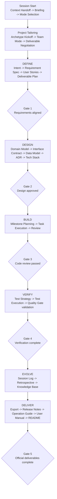

# Cowork Rules

> Master operating document that defines the framework's principles, structure, and lifecycle

---

## Philosophy

This framework defines the rules and deliverable system for software development where AI and Humans work as **equal collaboration partners**.

### Core Principles

| # | Principle | Description |
|---|---|---|
| 1 | **Artifact Is Memory** | Artifacts are the AI's memory. Every decision and every piece of context must be written down. |
| 2 | **Plan -> Approve -> Execute** | The AI plans, the Human approves, and the AI executes. |
| 3 | **Mutual Respect** | Respect the AI's analysis, and treat the Human's judgment as the final authority. |
| 4 | **Progressive Enrichment** | Each deliverable becomes context for the next step. Keep traceability intact. |
| 5 | **Minimal Ceremony** | Prefer substance over ceremony, but always leave what is necessary. |
| 6 | **Continuous Evolution** | Improve the rules themselves through retrospectives. |

---

## Operating Model

### Invariant Rules

- The Human has final decision authority.
- `.cowork/` documents are the project's shared source documents.
- Record confirmed facts, working assumptions, and open items separately.
- Major decisions and release deliverables must leave traceable evidence.

### AI Discretion Area

- The AI may propose or apply better question order, document structure, summarization style, and official-deliverable wording.
- As AI capabilities improve, it may attempt better planning, documentation, and official deliverable generation.
- It may use that autonomy only without violating the invariant rules above.
- When a better collaboration pattern is discovered, the framework itself can be updated after Human approval.

---

## Governance Map

| Document | Responsibility |
|------|------|
| `README.md` | Intro summary, quick start, entry prompts |
| `cowork.md` | Master document that explains principles, structure, and lifecycle |
| `01_cowork_protocol/session_protocol.md` | Session start, in-progress, end, and automation procedures |
| `01_cowork_protocol/tooling_environment_guide.md` | Tool-specific approval, entrypoint sync, and upgrade operation |
| `01_cowork_protocol/communication_convention.md` | Single source for language policy, tone, expression depth, and visualization rules |
| `01_cowork_protocol/decision_authority_matrix.md` | Decision-authority boundary between Human and AI |
| `01_cowork_protocol/escalation_policy.md` | Disagreement and mediation rules |
| `01_cowork_protocol/document_role_inventory.md` | Document-role classification and operating inventory |
| `01_cowork_protocol/document_change_impact_matrix.md` | Cascading-impact check when structure changes |
| `05_verification/quality_gate.md` | Phase-transition and release-decision criteria |

Interpret language policy, tone, and visualization rules through `communication_convention.md`.

---

## Document Role Rules

Read and operate `.cowork` documents according to their role.

| Role | Description | Operating Style | Default Loading |
|---|---|---|---|
| Governance | Framework rules, authority, quality criteria | Update directly | First session or when needed |
| Canonical | Single source document for the project | Accumulate updates directly in the same file | Default by phase |
| Registry | Short index of many objects | Update directly in the same path | Always or first |
| Instance | ID-based detailed document | Create as a new file | Load only active items when needed |
| Template | Source copied when creating new documents | Copy only | Not loaded by default |
| Log / Archive | Session logs, imported context, raw evidence | Append-only or supporting evidence | Not loaded by default |

### Default File Rules

- Files ending in `_template.md` are copy-only templates.
- Regular files without that suffix are generally governance documents, canonical documents, or registries.
- `INT-*`, `US-*`, `MS-*`, `TASK-*`, and `ADR-*` files are all instance documents.
- Documents under `members/<name>/workspace/session_logs/` and `imported_context/` are supporting evidence stores, not direct source documents.
- Official deliverable generation and gate decisions are based on canonical documents, registry documents, and instance documents, not templates.

---

## Operating Units

This framework distinguishes `Phase` and `Milestone`.

| Unit | Meaning | Nature |
|---|---|---|
| Phase | DEFINE, DESIGN, BUILD, VERIFY, EVOLVE, DELIVER | Fixed lifecycle of the framework |
| Milestone | Intermediate completion point for a specific project | Operating unit confirmed by Human approval |
| Task | Actual unit of execution | Smallest unit of implementation, documentation, or verification |

- `Phase` answers: "Which stage is the project in now?"
- `Milestone` answers: "What counts as meaningfully complete?"
- `Task` answers: "What are we doing right now?"

---

## Framework Structure

> Document roles are divided into `Governance / Canonical / Registry / Instance / Template / Log-Archive`.
> The actual work-breakdown axis is `Intent -> Milestone -> Task`.

```text
.cowork/
├── README.md                                <- Quick-start overview
├── cowork.md                                <- This document
│
├── 01_cowork_protocol/                      <- HOW: how collaboration works
│   ├── decision_authority_matrix.md         <- Decision authority matrix
│   ├── session_protocol.md                  <- Session start / in-progress / end protocol
│   ├── tooling_environment_guide.md         <- Tool- and environment-dependent operations
│   ├── communication_convention.md          <- Language / tone / visualization rules
│   ├── escalation_policy.md                 <- Disagreement handling policy
│   ├── document_role_inventory.md           <- Document role inventory
│   └── document_change_impact_matrix.md     <- Change impact matrix
│
├── 02_project_definition/                   <- WHAT: what we are building
├── 03_design_artifacts/                     <- HOW: how we will build it
├── 04_implementation/                       <- BUILD: implementation standards and execution units
├── 05_verification/                         <- VERIFY: verification system and gates
├── 06_evolution/                            <- LEARN: state, retrospective, knowledge accumulation
├── 07_delivery/                             <- DELIVER: official deliverable generation
└── members/                                 <- TEAM: personal state and session logs
```

Use `document_role_inventory.md` as the authority for detailed document classification and the full inventory.

---

## Development Flow (Lifecycle)

`session_protocol.md` defines the detailed procedure, `tooling_environment_guide.md` defines tool- and environment-dependent operation, and this document keeps only the high-level flow.



---

## Context Loading Principles

- At session start, load `project_state.md`, `deliverable_plan.md`, the relevant registries, and the latest session log first.
- `project_state.md` is the shared resume index that is always loaded, so keep narrative sections short and keep tables focused on active or recent key items.
- Load detail documents like `INT-*`, `MS-*`, `TASK-*`, and `ADR-*` only when deeper context is needed.
- `templates/` and `imported_context/` are not default-loading targets.
- Imported context should remain only as supporting evidence after the required facts are extracted into registries, canonical documents, or instance documents.

---

## Core Object Notes

This framework uses `Intent -> Milestone -> Task` as the default work-breakdown axis.

- `Intent`: a top-level goal that defines the direction, purpose, and scope of the project
- `Milestone`: a meaningful intermediate completion point and approval unit
- `Task`: the execution unit for actual implementation, documentation, and verification
- `User Story` and `ADR` do not replace that hierarchy; they act as cross-reference axes.
- A personal session goal is recorded as Session Intent in `my_state.md` and is separate from the project Intent.

Refer to the related sections in `session_protocol.md` for state transitions, change types, and detailed decision flow.

---

## References

This framework was designed with reference to the following sources.

| Source | Key Borrowing |
|------|---------------|
| **AWS AI-DLC** (Raja SP) | Intent-Unit-Bolt structure, Plan-Approve-Execute pattern, Mob Elaboration |
| **Agile / Scrum** | User Story, Acceptance Criteria, Sprint concepts |
| **Domain-Driven Design** | Bounded Context, Aggregate, Ubiquitous Language |
| **ADR (Architecture Decision Records)** | Decision traceability |
| **Anthropic CLAUDE.md** | Project context file concept for AI agents |
| **GitHub Copilot Instructions** | Context injection through `.github/copilot-instructions.md` |
| **OpenAI AGENTS.md** | Project-operation guidance file concept that Codex and Cursor can share |

> This document and every template beneath it are living documents.
> They continue to evolve through project execution and retrospectives.
