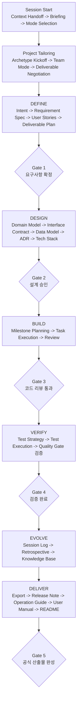

# 협업 프레임워크 규칙 (Cowork Rules)

> 원칙, 구조, 라이프사이클을 정의하는 마스터 운영 기준 문서

---

## 철학

이 프레임워크는 AI와 Human이 **대등한 협업 파트너**로서 소프트웨어를 개발하기 위한 규칙과 산출물 체계를 정의한다.

### 핵심 원칙

| # | 원칙 | 설명 |
|---|---|---|
| 1 | **Artifact is Memory** | 산출물이 곧 AI의 기억이다. 모든 결정과 맥락은 문서에 남긴다. |
| 2 | **Plan → Approve → Execute** | AI가 계획하고, Human이 승인하고, AI가 실행한다. |
| 3 | **Mutual Respect** | AI의 분석을 존중하고, Human의 판단을 최종 권위로 삼는다. |
| 4 | **Progressive Enrichment** | 각 산출물은 다음 단계의 컨텍스트가 된다. 추적성을 유지한다. |
| 5 | **Minimal Ceremony** | 형식보다 실질을 우선하되, 필요한 것은 반드시 남긴다. |
| 6 | **Continuous Evolution** | 규칙 자체도 회고를 통해 지속적으로 개선한다. |

---

## 운영 모델

### 불변 규칙

- Human이 최종 결정권을 가진다.
- `.cowork/` 문서는 프로젝트의 공유 기준 문서다.
- 확정된 사실, 가정, 미확정 사항은 구분하여 기록한다.
- 주요 결정과 릴리즈 산출물은 추적 가능한 근거를 남긴다.

### AI 재량 영역

- AI는 더 나은 질문 순서, 문서 구조, 요약 방식, 공식 산출물 생성 표현을 제안하거나 적용할 수 있다.
- AI 성능이 향상되면 더 높은 품질의 계획, 문서화, 공식 산출물 생성을 시도할 수 있다.
- 다만 위 불변 규칙을 깨지 않는 범위에서만 자율성을 행사한다.
- 더 나은 협업 방식이 발견되면 Human 승인 후 프레임워크 자체를 갱신한다.

---

## 운영 기준 문서 맵 (Governance Map)

| 문서 | 책임 |
|------|------|
| `README.md` | 입문용 요약, 빠른 시작, 진입 프롬프트 |
| `cowork.md` | 원칙, 구조, 라이프사이클을 설명하는 마스터 문서 |
| `01_cowork_protocol/session_protocol.md` | 세션 시작, 진행, 종료, 자동화 절차 |
| `01_cowork_protocol/tooling_environment_guide.md` | 도구별 승인, 진입점 동기화, 업그레이드 운영 |
| `01_cowork_protocol/communication_convention.md` | 언어 정책, 톤, 표현 수준, 시각화 규칙의 단일 기준 |
| `01_cowork_protocol/decision_authority_matrix.md` | Human / AI 의사결정 권한 경계 |
| `01_cowork_protocol/escalation_policy.md` | 의견 불일치와 중재 규칙 |
| `01_cowork_protocol/document_role_inventory.md` | 문서 역할 분류와 운영 인벤토리 |
| `01_cowork_protocol/document_change_impact_matrix.md` | 구조 변경 시 연쇄 영향 점검 |
| `05_verification/quality_gate.md` | 단계 전환과 릴리즈 판정 기준 |

언어 정책, 톤, 시각화 기준은 `communication_convention.md`를 기준으로 해석한다.

---

## 문서 역할 규칙

`.cowork`의 문서는 역할별로 구분해 읽고 운영한다.

| 역할 | 설명 | 운영 방식 | 기본 로딩 |
|---|---|---|---|
| 운영 기준 문서 (Governance) | 프레임워크 규칙, 권한, 품질 기준 | 직접 갱신 | 첫 세션 또는 필요 시 |
| 기준 본문 (Canonical) | 프로젝트별 단일 기준 문서 | 같은 경로에서 직접 누적 갱신 | Phase별 기본 로딩 |
| 목록 문서 (Registry) | 다수 객체의 짧은 인덱스 | 같은 경로에서 직접 갱신 | 항상 또는 우선 로딩 |
| 상세 문서 (Instance) | ID 기반 상세 문서 | 새 파일 생성 | 활성 항목만 필요 시 로딩 |
| 템플릿 (Template) | 새 문서를 만들 때 복사하는 원본 | 복사 전용 | 기본 비로딩 |
| 로그 / 아카이브 (Log / Archive) | 세션 로그, imported context, raw evidence | append-only 또는 보조 근거 | 기본 비로딩 |

### 파일 운영 기본 규칙

- `_template.md`가 붙은 파일은 복사 전용이다.
- suffix 없는 일반 문서는 기본적으로 운영 기준 문서, 기준 본문, 목록 문서 중 하나다.
- `INT-*`, `US-*`, `MS-*`, `TASK-*`, `ADR-*`는 모두 상세 문서다.
- `members/<이름>/workspace/session_logs/`, `imported_context/` 아래 문서는 보조 근거 저장소이며 직접 작업 기준 문서로 삼지 않는다.
- 공식 산출물 생성과 Gate 판단은 템플릿 파일이 아니라 기준 본문, 목록 문서, 상세 문서를 기준으로 한다.

---

## 운영 단위

이 프레임워크는 `Phase`와 `Milestone`을 구분한다.

| 단위 | 의미 | 성격 |
|---|---|---|
| Phase | DEFINE, DESIGN, BUILD, VERIFY, EVOLVE, DELIVER | 프레임워크의 고정 라이프사이클 |
| Milestone | 프로젝트별 중간 완료 지점 | Human 승인으로 확정되는 운영 단위 |
| Task | 실제 실행 단위 | 구현, 문서, 검증의 최소 작업 단위 |

- `Phase`는 "지금 프로젝트가 어느 단계에 있는가"를 나타낸다.
- `Milestone`은 "무엇이 끝났다고 볼 것인가"를 나타낸다.
- `Task`는 "지금 무엇을 수행하는가"를 나타낸다.

---

## 프레임워크 구조

> 문서 역할은 `운영 기준 문서 / 기준 본문 / 목록 문서 / 상세 문서 / 템플릿 / 로그·아카이브`로 나뉜다.
> 실제 작업 분해 축은 `Intent -> Milestone -> Task`를 기본으로 한다.

```text
.cowork/
├── README.md                                ← 입문용 빠른 시작
├── cowork.md                                ← 이 문서
│
├── 01_cowork_protocol/                      ← HOW: 어떻게 협업하는가
│   ├── decision_authority_matrix.md         ← 의사결정 권한 매트릭스
│   ├── session_protocol.md                  ← 세션 시작/진행/종료 프로토콜
│   ├── tooling_environment_guide.md         ← 도구/환경 의존 운영 가이드
│   ├── communication_convention.md          ← 언어/톤/시각화 기준
│   ├── escalation_policy.md                 ← 의견 불일치 해결 정책
│   ├── document_role_inventory.md           ← 문서 역할 인벤토리
│   └── document_change_impact_matrix.md     ← 수정 영향 추적 매트릭스
│
├── 02_project_definition/                   ← WHAT: 무엇을 만드는가
├── 03_design_artifacts/                     ← HOW: 어떻게 만드는가
├── 04_implementation/                       ← BUILD: 구현 기준과 실행 단위
├── 05_verification/                         ← VERIFY: 검증 체계와 gate
├── 06_evolution/                            ← LEARN: 상태, 회고, 지식 축적
├── 07_delivery/                             ← DELIVER: 공식 산출물 생성
└── members/                                 ← TEAM: 개인 상태와 세션 로그
```

구체적인 문서 분류와 전체 인벤토리는 `document_role_inventory.md`를 기준으로 해석한다.

---

## 개발 흐름 (Lifecycle)

세부 절차는 `session_protocol.md`, 도구/환경 의존 운영은 `tooling_environment_guide.md`가 기준이고, 이 문서는 상위 흐름만 유지한다.



---

## 컨텍스트 로딩 원칙

- 세션 시작 시에는 `project_state.md`, `deliverable_plan.md`, 관련 목록 문서, 최신 세션 로그를 우선 로드한다.
- `project_state.md`는 항상 로드되는 공유 인덱스이므로, 서술형 섹션은 짧게 유지하고 표도 활성/최근 핵심 항목 위주로 관리한다.
- 상세 맥락이 필요할 때만 `INT-*`, `MS-*`, `TASK-*`, `ADR-*` 같은 상세 문서를 추가 로드한다.
- `templates/`와 `imported_context/`는 기본 로딩 대상이 아니다.
- imported context는 필요한 사실을 목록 문서, 기준 본문, 상세 문서로 추출한 뒤 보조 근거로만 남긴다.

---

## 핵심 객체 운영 메모

이 프레임워크는 `Intent -> Milestone -> Task`를 기본 작업 분해 축으로 사용한다.

- `Intent`: 프로젝트의 방향, 목적, 범위를 정의하는 상위 목표
- `Milestone`: 의미 있는 중간 완료 지점과 승인 단위
- `Task`: 실제 구현, 문서화, 검증의 실행 단위
- `User Story`, `ADR`은 위 계층을 대체하지 않고 교차 참조 축으로 동작한다.
- 개인 세션 목표는 `my_state.md`의 Session Intent로 기록하며, Project Intent와 구분한다.

상태 전이, 변경 유형, 세부 판단 흐름은 `session_protocol.md`의 관련 섹션을 참조한다.

---

## 참고 출처

이 프레임워크는 다음을 참고하여 설계되었다.

| 출처 | 핵심 차용 |
|------|-----------|
| **AWS AI-DLC** (Raja SP) | Intent-Unit-Bolt 구조, Plan-Approve-Execute 패턴, Mob Elaboration |
| **Agile / Scrum** | User Story, Acceptance Criteria, Sprint 개념 |
| **Domain-Driven Design** | Bounded Context, Aggregate, Ubiquitous Language |
| **ADR (Architecture Decision Records)** | 의사결정 추적성 |
| **Anthropic CLAUDE.md** | AI 에이전트용 프로젝트 컨텍스트 파일 개념 |
| **GitHub Copilot Instructions** | `.github/copilot-instructions.md` 기반 컨텍스트 주입 |
| **OpenAI AGENTS.md** | Codex와 Cursor가 함께 활용할 수 있는 프로젝트 운영 지침 파일 개념 |

> 이 문서와 하위 모든 템플릿은 살아있는 문서로서,
> 프로젝트 진행과 회고를 통해 지속적으로 진화한다.
